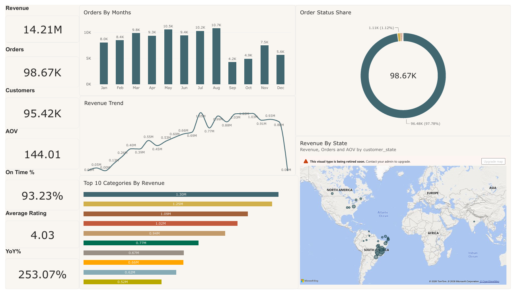
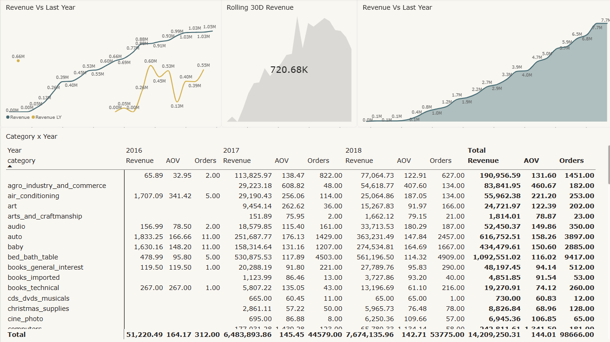
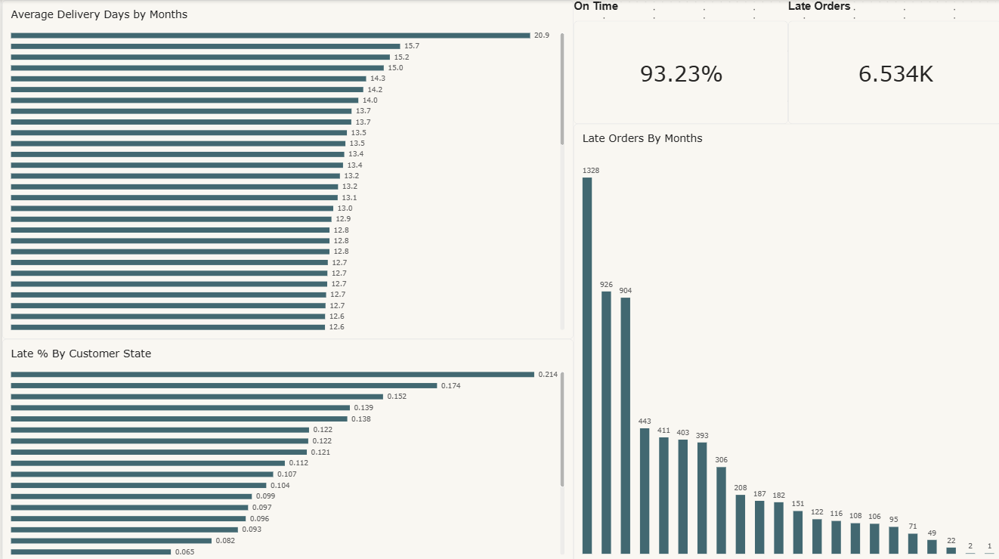

# Olist Sales Analytics

End-to-end analytics pipeline built on the [Olist Brazilian E-Commerce public dataset](https://www.kaggle.com/datasets/olistbr/brazilian-ecommerce): raw transactional data loaded into PostgreSQL, reshaped into a reporting layer of SQL views, and modeled in Power BI across a nine-page dashboard covering revenue, delivery performance, customer geography, sellers, payments, and review sentiment.

**Stack:** PostgreSQL · SQL · Power BI · DAX · DirectQuery + Composite Model
**Data:** 98,666 orders · September 2016 – October 2018

Full technical documentation (schema, data model, DAX reference, findings, issue log) is available here: **[Olist Sales Analytics — Technical Documentation](Olist_Sales_Analytics_Documentation.docx)**

---

## Overview

| Metric | Value |
|---|---|
| Total revenue | $14.21M |
| Orders | 98,666 |
| Customers | 95,420 |
| Average order value | $144.01 |
| On-time delivery | 93.23% |
| Average rating | 4.03 / 5 |

---

## 📸 Dashboard Screenshots

<p align="center">
  
  <br/><em>Overview — Revenue KPIs, monthly order trends, top 10 categories by revenue, and geographic distribution</em>
</p>

<p align="center">
  
  <br/><em>Sales — Revenue vs prior year, rolling 30-day trend line, and category × year breakdown table</em>
</p>

<p align="center">
  
  <br/><em>Delivery — 93.23% on-time rate, average delivery days by month, and late order volume trend</em>
</p>

<p align="center">
  
  <br/><em>Category &amp; Products — AOV vs order count scatter, category performance summary, and revenue treemap</em>
</p>

---

## Architecture

```
Kaggle CSVs  →  PostgreSQL raw tables  →  BI views  →  Power BI (DirectQuery)
 (9 files)      (COPY, PK/FK, indexes)    (dedup,       + DimDate (Import)
                                           joins,        + 25 DAX measures
                                           derived       + 9 report pages
                                           fields)
```

`bi_fact_sales` stays in DirectQuery mode, querying PostgreSQL live rather than caching a copy. `DimDate` is a DAX calculated table held in Import mode — a composite model, one of Power BI's supported storage-mode combinations.

## Repository Structure

```
├── Olist_Sales_Analytics_Documentation.docx   # full technical & analytical reference
├── LICENSE
├── Dashboard/
│   ├── Analytical Dashboard.pbix
│   ├── Analytical Dashboard.pdf               # static export of the report
│   ├── Overview.png
│   ├── Sales.png
│   ├── Delivery.png
│   └── Category & Products.png
└── Source/
    ├── project assets/
    │   ├── Tables.sql               # raw table DDL
    │   ├── ForeignKey.sql           # FK constraints
    │   ├── Index.sql                # join/filter indexes
    │   ├── CopyCSV.sql              # CSV load script
    │   ├── BIViews.sql              # reporting views (bi_fact_sales, etc.)
    │   ├── DateDim.sql              # DimDate DAX calculated-table expression
    │   ├── DAX Measures.txt         # all 25 report measures
    │   ├── report_page_design.md    # page/visual design spec
    │   └── Steps To Follow.txt      # build notes
    └── archive/                     # raw Olist CSVs — not committed, see below
```

Raw CSVs (~121MB) are not committed — download the source dataset directly from [Kaggle](https://www.kaggle.com/datasets/olistbr/brazilian-ecommerce) and place the files under `Source/archive/`.

## Key Findings

- **Revenue grew sharply**: $51K (2016, partial year) → $6.48M (2017) → $7.67M (2018)
- **Late delivery is the strongest driver of dissatisfaction**: average rating drops from 4.2 (on-time) to 2.3 (late) — a ~1.9-point swing
- **Revenue is geographically concentrated**: São Paulo alone accounts for ~38% of total revenue ($5.4M of $14.21M)
- **Category leaders**: health_beauty ($1.30M), watches_gifts ($1.25M), and bed_bath_table ($1.09M) lead by revenue
- **Seller concentration**: of 3,095 sellers, the top individual seller generated $245K — ~53x the average seller's revenue
- **Payment behavior**: credit card drives 76.8% of payment value, with a notably higher average installment count (3.6) than other methods (all ~1.0)
- **Review sentiment**: ~77% positive, ~9% negative — the negative tail is largely explained by late deliveries, not product dissatisfaction

## Setup

1. Create a PostgreSQL database and run `Source/project assets/Tables.sql`.
2. Run `Source/project assets/CopyCSV.sql` to load the CSVs (replace the `<PROJECT_PATH>` placeholder with the local path first — Postgres `COPY` runs server-side).
3. Run `Source/project assets/ForeignKey.sql`, then `Index.sql`.
4. Run `Source/project assets/BIViews.sql` to create the reporting views.
5. In Power BI Desktop, open `Dashboard/Analytical Dashboard.pbix` (or connect fresh to `bi_fact_sales` using DirectQuery).
6. Add the `DimDate` calculated table (`Source/project assets/DateDim.sql`), relate it to `bi_fact_sales[purchase_date]`, and mark it as the model's date table.
7. Load the measures from `Source/project assets/DAX Measures.txt`.
